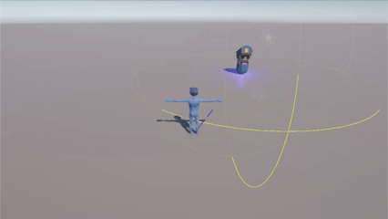

<div align="center">

# NPC Detector

An enemy NPC that notices you when you get close, and shows it.
Built for the first lab of the Intelligent Games course.




</div>

---

## Running it

Clone the repo and open the folder with Unity 6.3 LTS. Unity will rebuild the
`Library` folder on first launch, which takes a few minutes.

Open `Assets/Scenes/NPCDetector.unity` and press Play. Move with **WASD** or the
arrow keys and walk towards the enemy.

Keep the Console visible while you play. Every state change is logged there,
and the detection radii are drawn in the Scene view.

## How it works

The enemy runs one cycle every frame: read the world, decide what that means,
then do something about it. All three steps live in `EnemyDetector.cs`.

**Perception** is a single distance measurement. No line of sight, no hearing,
nothing else yet.

```csharp
currentDistance = Vector3.Distance(transform.position, player.position);
```

**Decision** compares that distance against two radii. The inner one is checked
first, since anything inside it is also inside the outer one.

| Distance | State | Light |
|---|---|---|
| more than 8 m | Idle | blue |
| 8 m or less | Suspicious | yellow |
| 4 m or less | Alert | red |

**Action** is what you actually see. The enemy's point light changes color, and
if `EnemyPatrol` is attached, the enemy stops walking once it goes Alert.

Both radii are exposed in the Inspector, so the behavior can be retuned without
touching the code. That is the whole point of keeping them as parameters.

The state only changes on a real transition, which keeps the Console readable —
one line per event instead of sixty per second.

## Scripts

| File | Job |
|---|---|
| `PlayerController.cs` | Keyboard movement on the XZ plane |
| `EnemyDetector.cs` | Perception, decision, action, and the debug gizmos |
| `EnemyPatrol.cs` | Walks the enemy between two points, pauses when alert |
| `CameraFollow.cs` | Third person camera trailing the player |

## Notes

The enemy has no memory. Step out of range and it forgets you immediately —
that comes later in the course.

Patrolling is not part of the original lab brief. It was added because a
stationary enemy makes for a dull demo.
